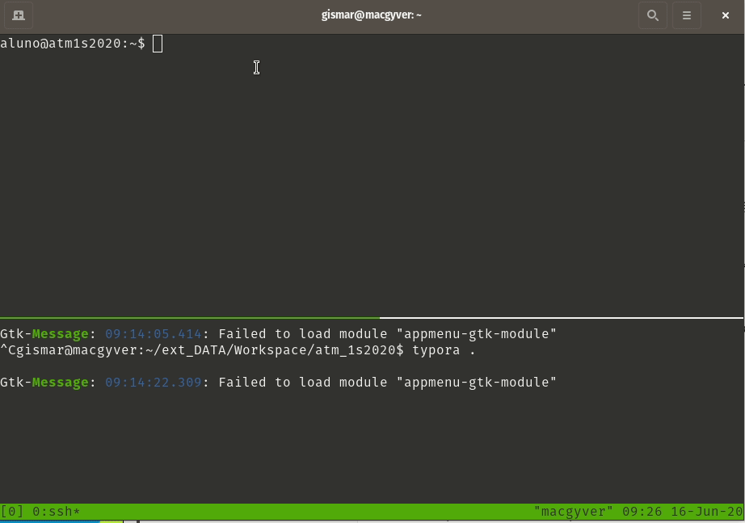

# UFW : Procedimentos de Instalação e Configuração do serviço de Firewall

## Objetivo

Promover o **download**, **instalação** e **configuração** do serviço de firewall ***UFW*** *(interface básica para realizar as configurações de firewall no Linux Ubuntu)*. ***Aqui, será demonstrada a forma básica de realizar o procedimento e configuração***.

O pacote que utilizaremos será o ***ufw*** *(e suas dependências)*.

> ***Observação:*** *todos os procedimentos demonstrados e comentados aqui, serão baseados na distribuição Ubuntu Server 18.04.4 (demais versões de Ubuntu Server, anteriores ou posteriores, poderão ter procedimentos diferentes para a instalação destes serviços).*
>
> ***Para outras distribuições, pesquisar a documentação para específica para cada distribuição.***

## Como fazer

#### **Download**: 

O download do arquivos de instalação da ferramenta de firewall poderão ser feitos de várias formas, inclusive pelo site oficial do UFW *([Download](https://pkgs.org/download/ufw))*. Nós aqui, indicamos que o mesmo seja ***baixado do repositório oficial do Ubuntu Server, via apt***.

#### Instalação: 

Seguido as recomendações prévias *(utilizando os repositórios oficiais da distribuição via apt)*,  para instalação do serviço de firewall UFW, no terminal, digite:

`sudo apt install ufw`

> #### *Observação:* 
>
> *Todas as versões atuais do Ubuntu Server (inclusive a que estamos usando para este projeto, 18.04.1) já vem com o UFW pré-instalado,  porém desativado. Desta forma, não será necessário baixar e/ou instalar o mesmo.*
>
> *Mas, para manter o formato dos documentos já presentes neste projeto, acima deixamos descritos todos os procedimentos de **download** e **instalação**.*

#### Configuração:

Inicialmente, ***o firewall UFW estará desativado***. Desta forma, ***iremos fazer todas as configurações necessárias para para que o servidor Web funcione perfeitamente***, assim como esteja seguro contra acessos não autorizados. Por fim, ***ativaremos o funcionamento todas regras de firewall***, colocando as mesmas em prática no ambiente do servidor Web.

> ***Observação****: todas as regras devem ser digitadas no terminal*

Configurações iniciais *(fechado para entradas, e aberto para saídas)*:

`sudo ufw default deny incoming`

`sudo ufw default allow outgoing`

Regras de firewall para o serviço de ***SSH*** *(porta TCP 22)*:

`sudo ufw allow ssh`

Regras de firewall para o ***servidor web Apache*** *(portas http/https 80/443)*:

`sudo ufw allow in "Apache Full"`

Regras de firewall para o serviço de compartilhamento de arquivos ***SAMBA***:

`sudo ufw allow samba`

Regras de firewall para o serviço do ***MySQL Server*** *:

`sudo ufw allow mysql`

Regras de firewall para o serviço de ***FTP - VSFTPD*** *(portas padrão 21 e 22, e portas modo passivo)*:

`sudo ufw allow 20/tcp`
`sudo ufw allow 21/tcp`
`sudo ufw allow 40000:50000/tcp`
`sudo ufw allow 990/tcp`

Para conferir todas as regras cadastradas:

`sudo ufw status`

E, com esse comando, será exibida uma tela como essa:

Ativando o o firewall para que todas as regras sejam aplicadas:

`sudo ufw enable`

Após todos estes procedimentos, ***do ponto de vista de tráfico de redes***, estará protegido contra acesso indevido, permitindo a entrada, ***única e exclusiva dos protocolos, portas e aplicações configuradas no firewall***.

## Referências

[Ubuntu - UFW](http://wiki.ubuntu-br.org/UFW)

[Ubuntu - Firewall](http://wiki.ubuntu-br.org/Firewall)

[UFW - Downloads](https://pkgs.org/download/ufw)

[Ubuntu - Repositórios UFW](https://ubuntu.pkgs.org/)

